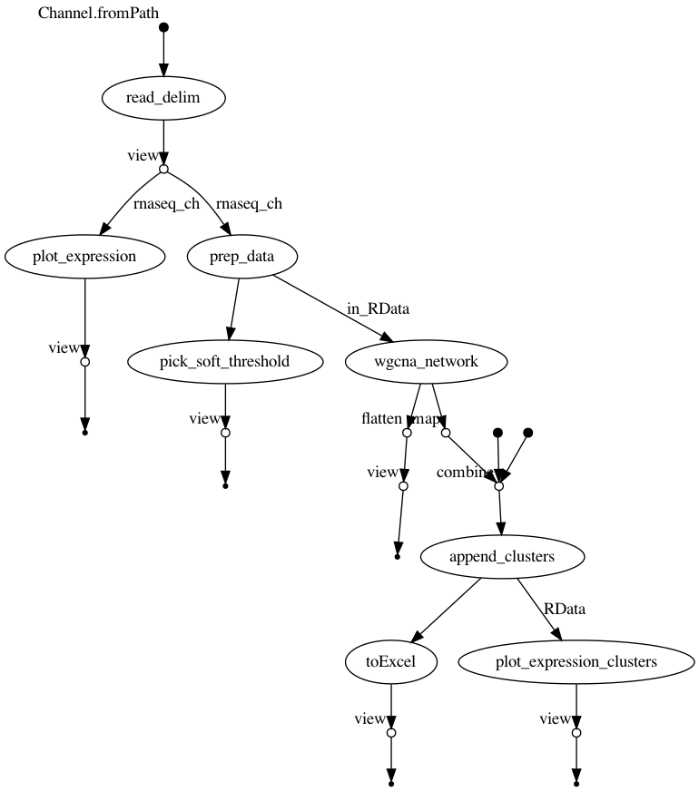
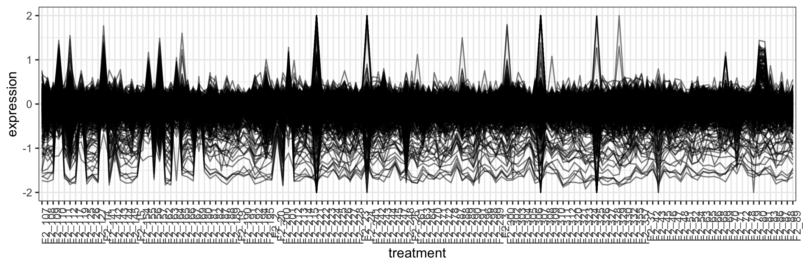
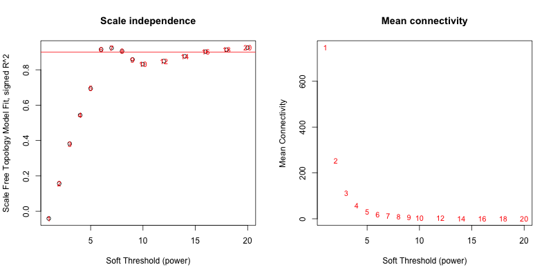
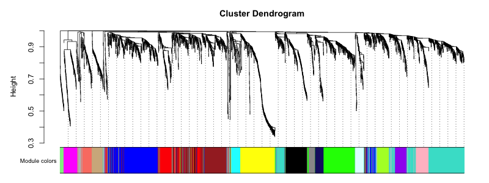
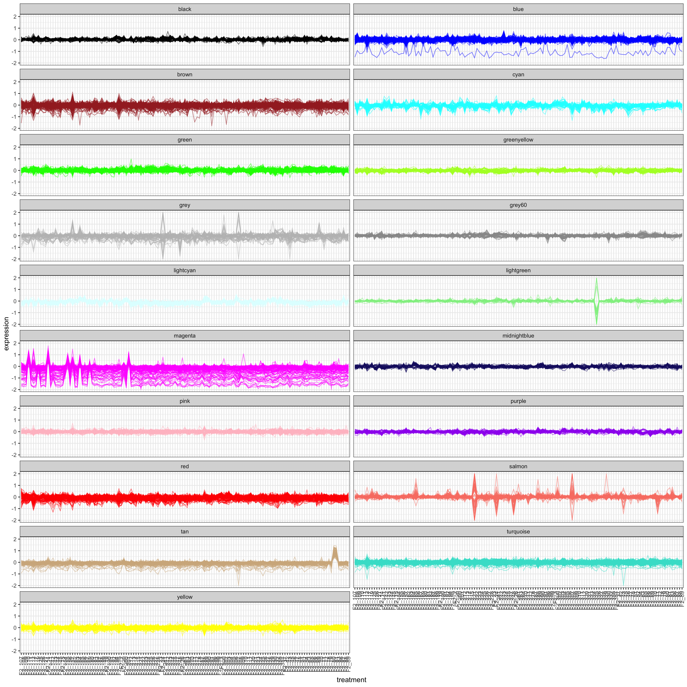

# wgcna_nf

Attempt a non-bash pipeline in nextflow. In this case, this nextflow script is wrapping the R wgcna pipeline.

```
$ nextflow run j23414/wgcna_nf -r main --help

N E X T F L O W  ~  version 20.07.1
Launching `main.nf` [nasty_leavitt] - revision: 88e77ac875
Usage:
   The typical command for running the pipeline is as follows:
   nextflow run main.nf --xlsx RNASeq.xlsx
   nextflow run main.nf --file RNASeq.csv --delim ','

   Mandatory arguments:
    --xlsx                  Excel file containing RNASeq counts where [columns = treatment; rows = genes/gene-probes]
    or
    --file                  Text file containing RNASeq counts where [columns = treatment; rows = genes/gene-probes]
    --delim                 Specifies the delimiter of the textfile [default: '\t']

   Optional configuration arguments:
    -profile                Configuration profile to use. Can use multiple (comma separated)
                            Available: local, condo, atlas, singularity [default:local]

   Optional other arguments:
    --help
```


**Main findings** of using R processes (instead of bash processes)

* Pass data between R processes via RData files

  ```
  load(\"$input_RData\")                        # <- load in prior data
  # ... R commands here
  save(data1, data2, data3, file = \"${input_RData.simpleName}.RData\")  #<- save output data
  ```

* Remember to escape double quotation marks inside nextflow script blocks
* Remember to escape R's `$` characters inside of nextflow script blocks (e.g. `data\$column`)

-----

### Tutorial

Fetch the WGCNA Tutorial dataset

```
wget https://horvath.genetics.ucla.edu/html/CoexpressionNetwork/Rpackages/WGCNA/Tutorials/FemaleLiver-Data.zip
unzip FemaleLiver-Data.zip

#> Archive:  FemaleLiver-Data.zip
#>  inflating: ClinicalTraits.csv      
#>  inflating: GeneAnnotation.csv      
#>  inflating: LiverFemale3600.csv 
```

Run pipeline on dataset

```
nextflow run main.nf --file LiverFemale3600.csv --delim ','

#> N E X T F L O W  ~  version 20.07.1
#> Launching `main.nf` [compassionate_bartik] - revision: abc410b4a8
#> Hello world
[2a/e61c02] process > read_delim (LiverFemale3600.csv)                          [100%] 1 of 1, cached: 1 ✔
[af/3ea062] process > plot_expression (LiverFemale3600.RData)                   [100%] 1 of 1, cached: 1 ✔
[6f/9594ac] process > prep_data (LiverFemale3600.RData)                         [100%] 1 of 1, cached: 1 ✔
[d9/52afcb] process > pick_soft_threshold (LiverFemale3600_mat.RData)           [100%] 1 of 1, cached: 1 ✔
[e0/6d2827] process > wgcna_network (LiverFemale3600_mat.RData)                 [100%] 1 of 1, cached: 1 ✔
[e6/c46ac4] process > append_clusters (LiverFemale3600_mat_clusters.RData)      [100%] 1 of 1, cached: 1 ✔
[c8/a6613f] process > toExcel (LiverFemale3600_clusters.RData)                  [100%] 1 of 1, cached: 1 ✔
[fb/e3789a] process > plot_expression_clusters (LiverFemale3600_clusters.RData) [100%] 1 of 1 ✔
...created:  results/LiverFemale3600.RData
...created:  results/expression.png
...created:  results/softthreshold.png
...created:  results/LiverFemale3600_matTOM-block.1.RData
...created:  results/wgcna_modules.png
...created:  results/LiverFemale3600_mat_clusters.RData
...created:  results/LiverFemale3600_clusters.xlsx
...created:  results/expression_clusters.png
```

-----

### FlowChart

Nextflow pipelines can also plot the directed acyclic graph (dag) of the pipeline using `-with-dag flowchart.png`

```
nextflow run main.nf --file LiverFemale3600.csv --delim ',' -resume -with-dag flowchart.png
```




-----

### Output Plots

**results/expression.png**



**results/softthreshold.png**



**results/wgcna_modules.png**




**results/expression_clusters.png**


