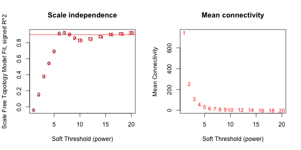

# A Nextflow Pipeline -- implementing a non-bash pipeline

In this case, this nextflow script is wrapping a popular R package, WGCNA.

## What is the WGCNA R package?

The WGCNA R package builds “weighted gene correlation networks for
analysis” from expression data. It was originally published in 2008 and
has been used in recent Maize papers for gray leaf disease response ([Yu
et
al, 2018](https://bmcgenomics.biomedcentral.com/articles/10.1186/s12864-018-5072-4#Sec2))
and development/nutrient/metabolism/stress response ([Ma et
al, 2017](https://pubmed.ncbi.nlm.nih.gov/28764653/)). The original
WGCNA publication is below:

  - Langfelder, P. and Horvath, S., 2008. [WGCNA: an R package for
    weighted correlation network
    analysis](https://bmcbioinformatics.biomedcentral.com/articles/10.1186/1471-2105-9-559).
    BMC bioinformatics, 9(1), p.559.
  - Zhang, B. and Horvath, S., 2005. [A general framework for weighted
    gene co-expression network
    analysis](https://pubmed.ncbi.nlm.nih.gov/16646834/). Statistical
    applications in genetics and molecular biology, 4(1).

More information

  - [WGCNA
    tutorial](https://horvath.genetics.ucla.edu/html/CoexpressionNetwork/Rpackages/WGCNA/Tutorials/)
  - [Recent PubMed Papers](https://pubmed.ncbi.nlm.nih.gov/?term=wgcna&sort=date)

### Installing WGCNA

``` r
# Ah, looks like WGCNA is now available directly on CRAN
install.packages("WGCNA")
```

## Running the Nextflow WGCNA pipeline

Here we have wrapped R's WGCNA pipeline in Nextflow dsl2. WGCNA expects RNAseq counts provided as either a Excel (`--xlsx RNASeq.xlsx`) or as a delimited textfile (`--file RNASeq.csv --delim ','`). The help statement with full usage descriptions can be printed using `--help` as shown below:

```
$ nextflow run j23414/wgcna_nf -r main --help

N E X T F L O W  ~  version 20.07.1
Launching `main.nf` [nasty_leavitt] - revision: 88e77ac875
Usage:
   The typical command for running the pipeline is as follows:
   nextflow run main.nf --xlsx RNASeq.xlsx
   nextflow run main.nf --file RNASeq.csv --delim ','

   Mandatory arguments:
    --xlsx                  Excel file containing RNASeq counts where [columns = treatment; rows = genes/gene-probes]
    or
    --file                  Text file containing RNASeq counts where [columns = treatment; rows = genes/gene-probes]
    --delim                 Specifies the delimiter of the textfile [default: '\t']

   Optional configuration arguments:
    -profile                Configuration profile to use. Can use multiple (comma separated)
                            Available: local, condo, atlas, singularity [default:local]

   Optional other arguments:
    --help
```

**Main insights of wrapping an R package in Nextflow:**

* Pass data between R processes via RData files

  ```
  load(\"$input_RData\")                        # <- load in prior data
  # ... R commands here
  save(data1, data2, data3, file = \"${input_RData.simpleName}.RData\")  #<- save output data
  ```

* Remember to escape double quotation marks inside nextflow script blocks
* Remember to escape R's `$` characters inside of nextflow script blocks (e.g. `data\$column`)

-----

## Case Study: Rerun the WGCNA tutorial using the Nextflow pipeline

Fetch the WGCNA Tutorial dataset

```
wget https://horvath.genetics.ucla.edu/html/CoexpressionNetwork/Rpackages/WGCNA/Tutorials/FemaleLiver-Data.zip
unzip FemaleLiver-Data.zip

#> Archive:  FemaleLiver-Data.zip
#>  inflating: ClinicalTraits.csv      
#>  inflating: GeneAnnotation.csv      
#>  inflating: LiverFemale3600.csv 
```

Run pipeline on dataset

```
nextflow run main.nf --file LiverFemale3600.csv --delim ','

#> N E X T F L O W  ~  version 20.07.1
#> Launching `main.nf` [compassionate_bartik] - revision: abc410b4a8
#> Hello world
[2a/e61c02] process > read_delim (LiverFemale3600.csv)                          [100%] 1 of 1, cached: 1 ✔
[af/3ea062] process > plot_expression (LiverFemale3600.RData)                   [100%] 1 of 1, cached: 1 ✔
[6f/9594ac] process > prep_data (LiverFemale3600.RData)                         [100%] 1 of 1, cached: 1 ✔
[d9/52afcb] process > pick_soft_threshold (LiverFemale3600_mat.RData)           [100%] 1 of 1, cached: 1 ✔
[e0/6d2827] process > wgcna_network (LiverFemale3600_mat.RData)                 [100%] 1 of 1, cached: 1 ✔
[e6/c46ac4] process > append_clusters (LiverFemale3600_mat_clusters.RData)      [100%] 1 of 1, cached: 1 ✔
[c8/a6613f] process > toExcel (LiverFemale3600_clusters.RData)                  [100%] 1 of 1, cached: 1 ✔
[fb/e3789a] process > plot_expression_clusters (LiverFemale3600_clusters.RData) [100%] 1 of 1 ✔
...created:  results/LiverFemale3600.RData
...created:  results/expression.png
...created:  results/softthreshold.png
...created:  results/LiverFemale3600_matTOM-block.1.RData
...created:  results/wgcna_modules.png
...created:  results/LiverFemale3600_mat_clusters.RData
...created:  results/LiverFemale3600_clusters.xlsx
...created:  results/expression_clusters.png
```

-----

### FlowChart

Nextflow pipelines can also plot the directed acyclic graph (dag) of the pipeline using `-with-dag flowchart.png`

```
nextflow run main.nf --file LiverFemale3600.csv --delim ',' -resume -with-dag flowchart.png
```


-----

### Output Plots

**results/expression.png**


**results/softthreshold.png**



**results/wgcna_modules.png**


**results/expression_clusters.png**


